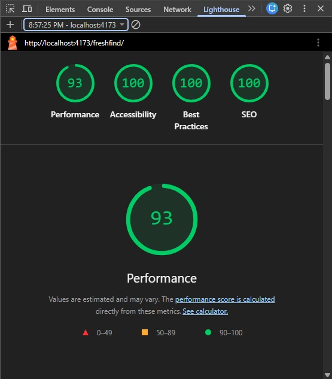
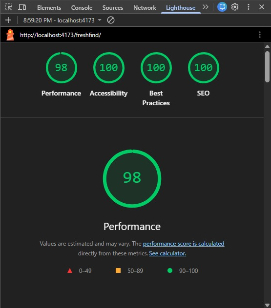

# Lighthouse Results

## In short
After our fixes every page scores 100 for accessibility, best practices and SEO, on both mobile and desktop. Desktop performance is between 97 and 100 on every page. On mobile, the average performance score went from 82 to 90, with the biggest jumps on Contact Us, from 70 to 97, the Home page, from 74 to 93, and My Bookmarks, from 78 to 97.

## What Lighthouse is and why we used it
Google Lighthouse is a free testing tool built into Chrome. It gives a web page a score from 0 to 100 in four areas: performance, which is how fast it loads; accessibility, which is whether people with poor sight or who only use a keyboard can use it; best practices, which is general code health and safety; and SEO, which is whether search engines can read it. A score of 90 or more is green, 50 to 89 is orange, and below 50 is red. The SRS asks us to test and validate the website with Lighthouse, so we tested every page, fixed what it found, and tested again.

## How we ran it
We tested the production build, not the development server, because the development server is deliberately slower. We ran npm run build, served the result with npm run preview, opened it in a Chrome incognito window so extensions could not change the scores, and ran Lighthouse from the Lighthouse tab in Chrome DevTools. Each of the eight pages was tested twice, once with the mobile setting and once with the desktop setting. The mobile setting pretends the page is running on a mid range phone with a slow connection, so it is the harder of the two. Before the first test we had already converted every photo to WebP, which cut the photos from about 100 MB to about 4 MB.

In the tables, P is Performance, A is Accessibility, BP is Best Practices and SEO is Search Engine Optimisation.

## Scores before our fixes

| Page | Mobile P | Mobile A | Mobile BP | Mobile SEO | Desktop P | Desktop A | Desktop BP | Desktop SEO |
| --- | --- | --- | --- | --- | --- | --- | --- | --- |
| Home | 74 | 100 | 100 | 91 | 96 | 100 | 100 | 91 |
| Market Directory | 84 | 98 | 100 | 91 | 98 | 98 | 100 | 91 |
| Market Detail (Mile 12) | 78 | 98 | 100 | 91 | 98 | 98 | 100 | 91 |
| Produce Guide | 95 | 99 | 100 | 91 | 93 | 99 | 100 | 91 |
| Seasonal Picks | 85 | 94 | 100 | 91 | 98 | 94 | 100 | 91 |
| My Bookmarks | 78 | 98 | 100 | 91 | 99 | 98 | 100 | 91 |
| Contact Us | 70 | 98 | 100 | 91 | 99 | 98 | 100 | 91 |
| About Us | 90 | 100 | 100 | 91 | 99 | 100 | 100 | 91 |

## What Lighthouse flagged and what we did

1. Document does not have a meta description (SEO, every page). A meta description is the short summary search engines show under a link. We added a one sentence description of FreshFind to index.html. SEO went from 91 to 100 on every page.

2. Heading elements are not in a sequentially descending order (Accessibility on the Market Directory, Market Detail, Produce Guide, Seasonal Picks, My Bookmarks and Contact Us). Screen readers use headings like a table of contents, and on these pages we skipped a level. We made the footer column headings one level higher in Footer.jsx and turned the results count on the Market Directory into a heading in Directory.jsx, keeping exactly the same look through CSS.

3. Elements use prohibited ARIA attributes (Accessibility on Seasonal Picks). Each green bar in the season calendar had a label for screen readers, but the bar had no role, so the label was not allowed. We gave each bar the role of an image in Seasonal.jsx, so the label is now read out. Accessibility on Seasonal Picks went from 94 to 100.

4. Render blocking requests and network dependency tree (Performance, every page). Our fonts were loaded from inside our own stylesheet, so the page waited for Google Fonts before it could show anything. We moved the font loading into index.html, connected to Google's font servers early, and loaded the fonts without holding up the first paint.

5. LCP request discovery and improve image delivery (Performance on mobile). The Home hero photo and the market banner were set as backgrounds, so the browser only found them after our JavaScript had run, and they were bigger than a phone needs. We turned them into real images the browser fetches early with high priority in Home.jsx and MarketDetail.jsx, made smaller copies of the hero and the market photos for small screens, and let the browser pick the right size in MarketCard.jsx and images.js.

## Scores after our fixes

| Page | Mobile P | Mobile A | Mobile BP | Mobile SEO | Desktop P | Desktop A | Desktop BP | Desktop SEO |
| --- | --- | --- | --- | --- | --- | --- | --- | --- |
| Home | 93 | 100 | 100 | 100 | 98 | 100 | 100 | 100 |
| Market Directory | 78 | 100 | 100 | 100 | 100 | 100 | 100 | 100 |
| Market Detail (Mile 12) | 79 | 100 | 100 | 100 | 98 | 100 | 100 | 100 |
| Produce Guide | 98 | 100 | 100 | 100 | 99 | 100 | 100 | 100 |
| Seasonal Picks | 86 | 100 | 100 | 100 | 97 | 100 | 100 | 100 |
| My Bookmarks | 97 | 100 | 100 | 100 | 100 | 100 | 100 | 100 |
| Contact Us | 97 | 100 | 100 | 100 | 100 | 100 | 100 | 100 |
| About Us | 89 | 100 | 100 | 100 | 100 | 100 | 100 | 100 |

## Performance before and after

| Page | Mobile before | Mobile after | Desktop before | Desktop after |
| --- | --- | --- | --- | --- |
| Home | 74 | 93 | 96 | 98 |
| Market Directory | 84 | 78 | 98 | 100 |
| Market Detail (Mile 12) | 78 | 79 | 98 | 98 |
| Produce Guide | 95 | 98 | 93 | 99 |
| Seasonal Picks | 85 | 86 | 98 | 97 |
| My Bookmarks | 78 | 97 | 99 | 100 |
| Contact Us | 70 | 97 | 99 | 100 |
| About Us | 90 | 89 | 99 | 100 |

Contact Us, Home and My Bookmarks improved the most on mobile, mainly from the font fix and, on the Home page, from the hero photo being found early.

The Market Directory went down on mobile, from 84 to 78, and Market Detail stayed about the same. Both pages show market photos near the top. The mobile test pretends to be a phone with a sharp, high resolution screen, so the browser still picks the larger photo for each card and banner. The next thing we would do is add a middle size photo made for phones.

Seasonal Picks and About Us moved by one point. That is normal, because scores move a few points between runs.

## Evidence
The full report for the Home page after the fixes is saved in the lighthouse folder next to this file, as home-desktop.html. Open it in Chrome to see the whole report.

## Things we kept on purpose
- Reduce unused JavaScript. All nine pages come in one bundle, so once the site has loaded, moving between pages is instant. Splitting it would save about 52 KiB on the first visit, and we chose the instant page changes.
- Use efficient cache lifetimes. This is how long the browser is told to keep downloaded files. It is set by the web server that hosts the site, not by our code, and the preview server we tested on is only for testing.
- The Google Maps embeds on Market Detail and Contact Us load Google's own code. The SRS asks for an embedded map, so they stay.

## How to run it yourself
1. Run npm run build.
2. Run npm run preview.
3. Open the address it prints in Chrome in an incognito window, so extensions do not change the score.
4. Press F12, open the Lighthouse tab, choose Mobile or Desktop, and click Analyze page load.

Scores move a few points between runs. That is normal.
