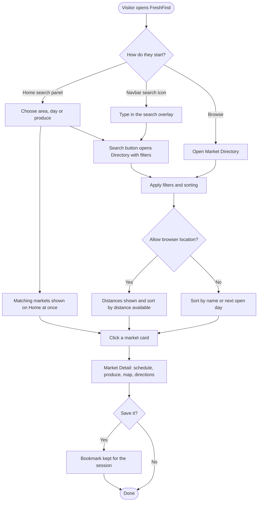

# Flowchart: finding a market

```mermaid
flowchart TD
  A([Visitor opens FreshFind]) --> B{How do they start?}
  B -->|Home search panel| C[Choose area, day or produce]
  B -->|Navbar search icon| D[Type in the search overlay]
  B -->|Browse| E[Open Market Directory]
  C --> F[Matching markets shown on Home at once]
  C --> G[Search button opens Directory with filters]
  D --> G
  E --> H[Apply filters and sorting]
  G --> H
  H --> I{Allow browser location?}
  I -->|Yes| J[Distances shown and sort by distance available]
  I -->|No| K[Sort by name or next open day]
  J --> L[Click a market card]
  K --> L
  F --> L
  L --> M[Market Detail: schedule, produce, map, directions]
  M --> N{Save it?}
  N -->|Yes| O[Bookmark kept for the session]
  N -->|No| P([Done])
  O --> P
```
