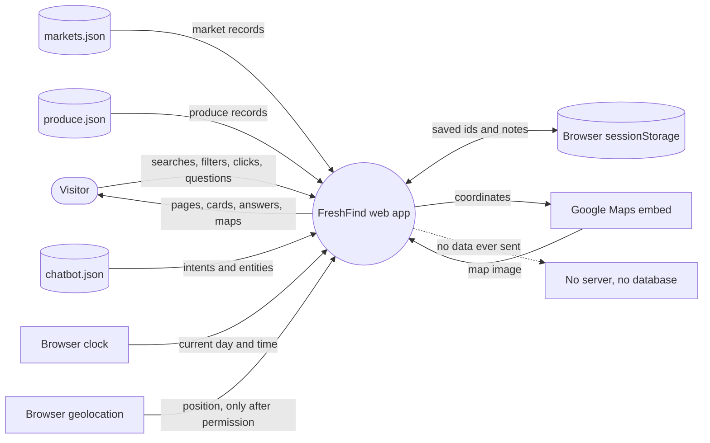

# Data Flow Diagram, Level 0 (context)

```mermaid
flowchart LR
  V([Visitor]) -->|searches, filters, clicks, questions| APP((FreshFind web app))
  APP -->|pages, cards, answers, maps| V
  D1[(markets.json)] -->|market records| APP
  D2[(produce.json)] -->|produce records| APP
  D3[(chatbot.json)] -->|intents and entities| APP
  APP <-->|saved ids and notes| D4[(Browser sessionStorage)]
  CLK[Browser clock] -->|current day and time| APP
  GEO[Browser geolocation] -->|position, only after permission| APP
  APP -->|coordinates| MAP[Google Maps embed]
  MAP -->|map image| APP
  APP -. no data ever sent .-> SRV[No server, no database]
```
