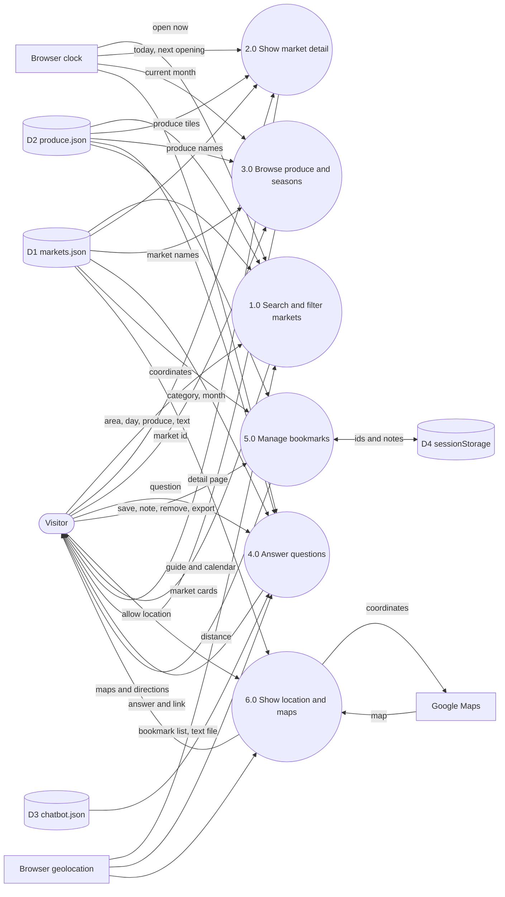

# Data Flow Diagram, Level 1

```mermaid
flowchart LR
  V([Visitor])
  D1[(D1 markets.json)]
  D2[(D2 produce.json)]
  D3[(D3 chatbot.json)]
  D4[(D4 sessionStorage)]
  CLK[Browser clock]
  GEO[Browser geolocation]
  MAP[Google Maps]

  P1((1.0 Search and filter markets))
  P2((2.0 Show market detail))
  P3((3.0 Browse produce and seasons))
  P4((4.0 Answer questions))
  P5((5.0 Manage bookmarks))
  P6((6.0 Show location and maps))

  V -->|area, day, produce, text| P1
  D1 --> P1
  D2 -->|produce names| P1
  CLK -->|open now| P1
  GEO -->|distance| P1
  P1 -->|market cards| V

  V -->|market id| P2
  D1 --> P2
  D2 -->|produce tiles| P2
  CLK -->|today, next opening| P2
  P2 -->|detail page| V

  V -->|category, month| P3
  D2 --> P3
  D1 -->|market names| P3
  CLK -->|current month| P3
  P3 -->|guide and calendar| V

  V -->|question| P4
  D3 --> P4
  D1 --> P4
  D2 --> P4
  CLK --> P4
  GEO --> P4
  P4 -->|answer and link| V

  V -->|save, note, remove, export| P5
  P5 <-->|ids and notes| D4
  D1 --> P5
  D2 --> P5
  P5 -->|bookmark list, text file| V

  V -->|allow location| P6
  GEO --> P6
  D1 -->|coordinates| P6
  P6 -->|coordinates| MAP
  MAP -->|map| P6
  P6 -->|maps and directions| V
```
