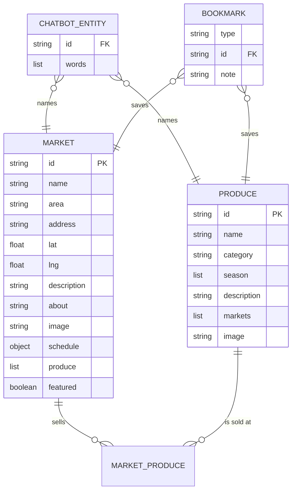

# Data model: how the JSON files relate

```mermaid
erDiagram
  MARKET ||--o{ MARKET_PRODUCE : sells
  PRODUCE ||--o{ MARKET_PRODUCE : "is sold at"
  CHATBOT_ENTITY }o--|| MARKET : "names"
  CHATBOT_ENTITY }o--|| PRODUCE : "names"
  BOOKMARK }o--|| MARKET : "saves"
  BOOKMARK }o--|| PRODUCE : "saves"
  MARKET {
    string id PK
    string name
    string area
    string address
    float lat
    float lng
    string description
    string about
    string image
    object schedule
    list produce
    boolean featured
  }
  PRODUCE {
    string id PK
    string name
    string category
    list season
    string description
    list markets
    string image
  }
  CHATBOT_ENTITY {
    string id FK
    list words
  }
  BOOKMARK {
    string type
    string id FK
    string note
  }
```
