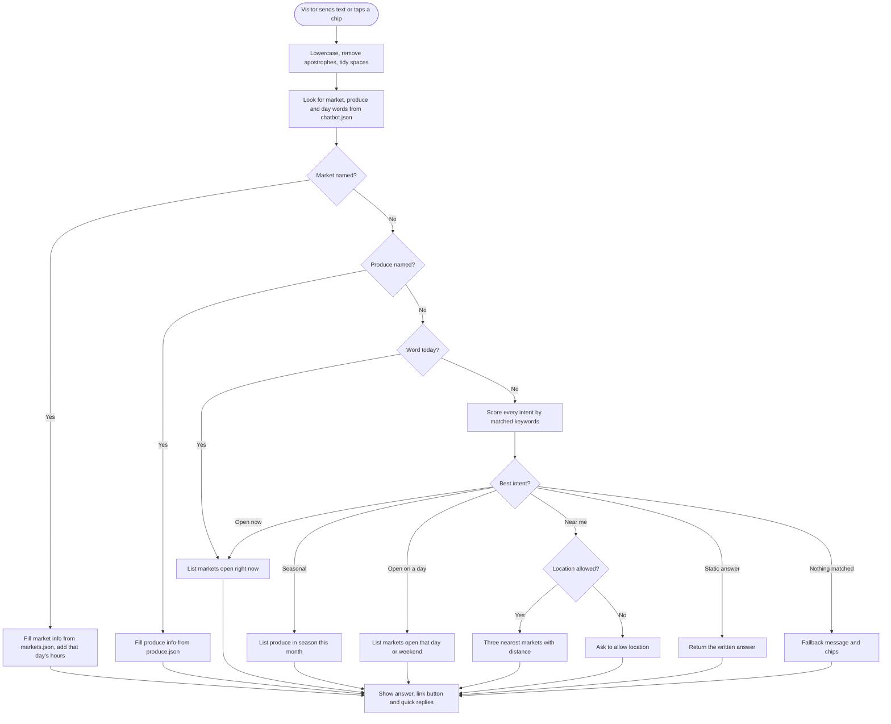

# Flowchart: how the assistant answers

```mermaid
flowchart TD
  A([Visitor sends text or taps a chip]) --> B[Lowercase, remove apostrophes, tidy spaces]
  B --> C[Look for market, produce and day words from chatbot.json]
  C --> D{Market named?}
  D -->|Yes| E[Fill market info from markets.json, add that day's hours]
  D -->|No| F{Produce named?}
  F -->|Yes| G[Fill produce info from produce.json]
  F -->|No| H{Word today?}
  H -->|Yes| I[List markets open right now]
  H -->|No| J[Score every intent by matched keywords]
  J --> K{Best intent?}
  K -->|Seasonal| L[List produce in season this month]
  K -->|Open now| I
  K -->|Open on a day| M[List markets open that day or weekend]
  K -->|Near me| N{Location allowed?}
  N -->|Yes| O[Three nearest markets with distance]
  N -->|No| P[Ask to allow location]
  K -->|Static answer| Q[Return the written answer]
  K -->|Nothing matched| R[Fallback message and chips]
  E --> S[Show answer, link button and quick replies]
  G --> S
  I --> S
  L --> S
  M --> S
  O --> S
  P --> S
  Q --> S
  R --> S
```
