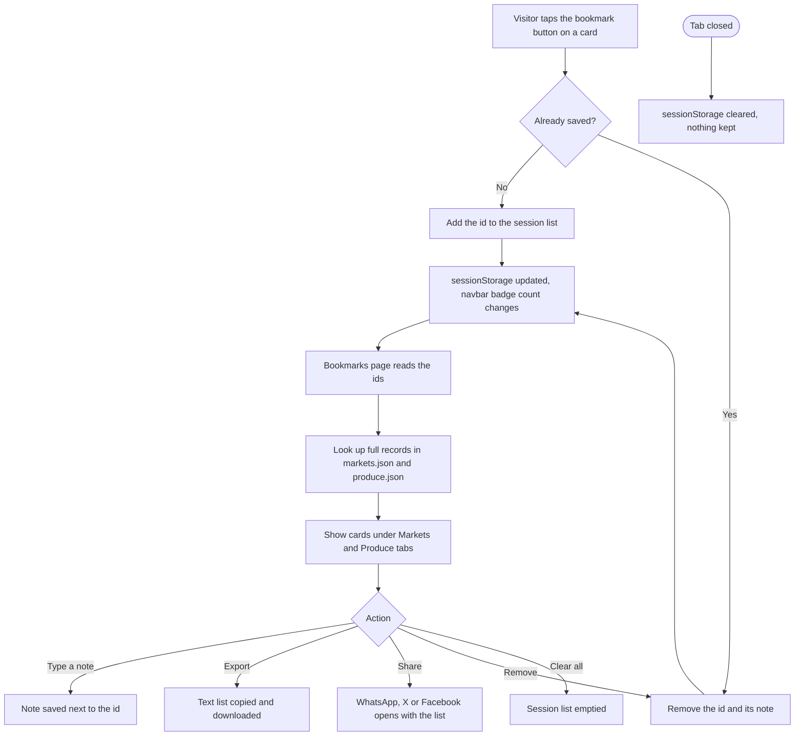

# Flowchart: bookmarks

```mermaid
flowchart TD
  A[Visitor taps the bookmark button on a card] --> B{Already saved?}
  B -->|No| C[Add the id to the session list]
  B -->|Yes| D[Remove the id and its note]
  C --> E[sessionStorage updated, navbar badge count changes]
  D --> E
  E --> F[Bookmarks page reads the ids]
  F --> G[Look up full records in markets.json and produce.json]
  G --> H[Show cards under Markets and Produce tabs]
  H --> I{Action}
  I -->|Type a note| J[Note saved next to the id]
  I -->|Export| K[Text list copied and downloaded]
  I -->|Share| L[WhatsApp, X or Facebook opens with the list]
  I -->|Remove| D
  I -->|Clear all| M[Session list emptied]
  T([Tab closed]) --> U[sessionStorage cleared, nothing kept]
```
