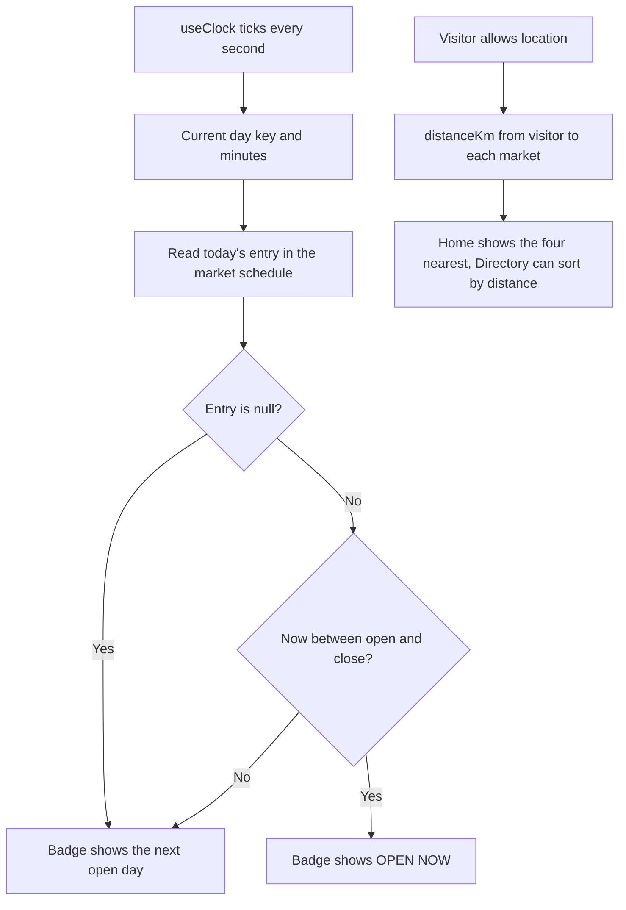

# Flowchart: open now and nearby

```mermaid
flowchart TD
  A[useClock ticks every second] --> B[Current day key and minutes]
  B --> C[Read today's entry in the market schedule]
  C --> D{Entry is null?}
  D -->|Yes| E[Badge shows the next open day]
  D -->|No| F{Now between open and close?}
  F -->|Yes| G[Badge shows OPEN NOW]
  F -->|No| E
  H[Visitor allows location] --> I[distanceKm from visitor to each market]
  I --> J[Home shows the four nearest, Directory can sort by distance]
```
