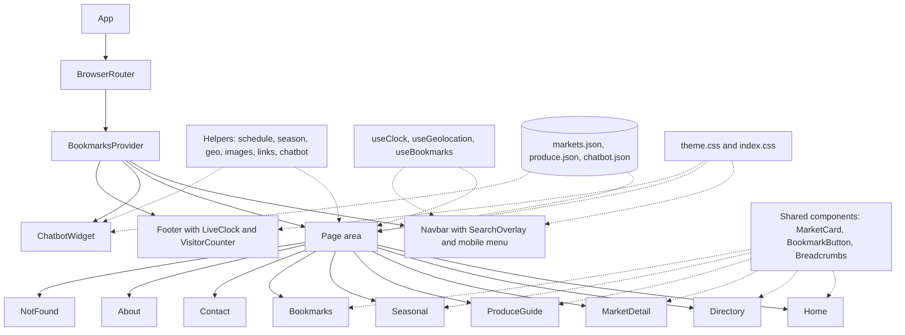

# Application structure

```mermaid
flowchart TD
  App --> Router[BrowserRouter]
  Router --> Ctx[BookmarksProvider]
  Ctx --> Nav[Navbar with SearchOverlay and mobile menu]
  Ctx --> Main[Page area]
  Ctx --> Chat[ChatbotWidget]
  Ctx --> Foot[Footer with LiveClock and VisitorCounter]
  Main --> Home
  Main --> Directory
  Main --> MarketDetail
  Main --> ProduceGuide
  Main --> Seasonal
  Main --> Bookmarks
  Main --> Contact
  Main --> About
  Main --> NotFound
  Shared[Shared components: MarketCard, BookmarkButton, Breadcrumbs] -.-> Home
  Shared -.-> Directory
  Shared -.-> MarketDetail
  Shared -.-> ProduceGuide
  Shared -.-> Seasonal
  Shared -.-> Bookmarks
  Utils[Helpers: schedule, season, geo, images, links, chatbot] -.-> Main
  Utils -.-> Chat
  Hooks[useClock, useGeolocation, useBookmarks] -.-> Main
  Hooks -.-> Nav
  Data[(markets.json, produce.json, chatbot.json)] -.-> Main
  Data -.-> Chat
  Theme[theme.css and index.css] -.-> Nav
  Theme -.-> Main
  Theme -.-> Foot
```
